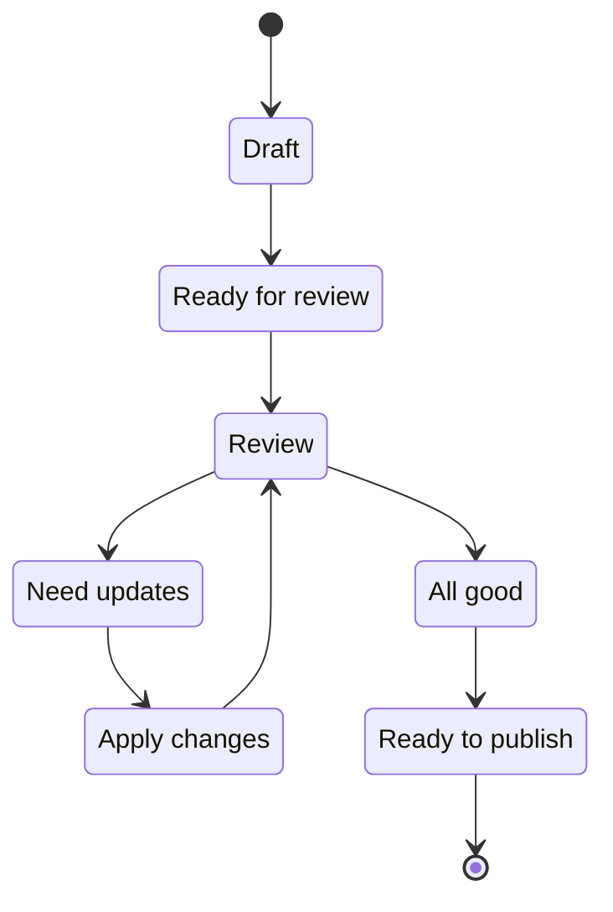

# ClassDiagramm

```mermaid

    stateDiagram-v2
    [*] --> Draft
    RR: Ready for review
    NU: Need updates
    AC: Apply changes
    LGTM: All good
    RP: Ready to publish
    Draft --> RR
    RR --> Review
    Review --> NU
    NU --> AC
    AC --> Review
    Review --> LGTM
    LGTM --> RP
    RP --> [*]

```