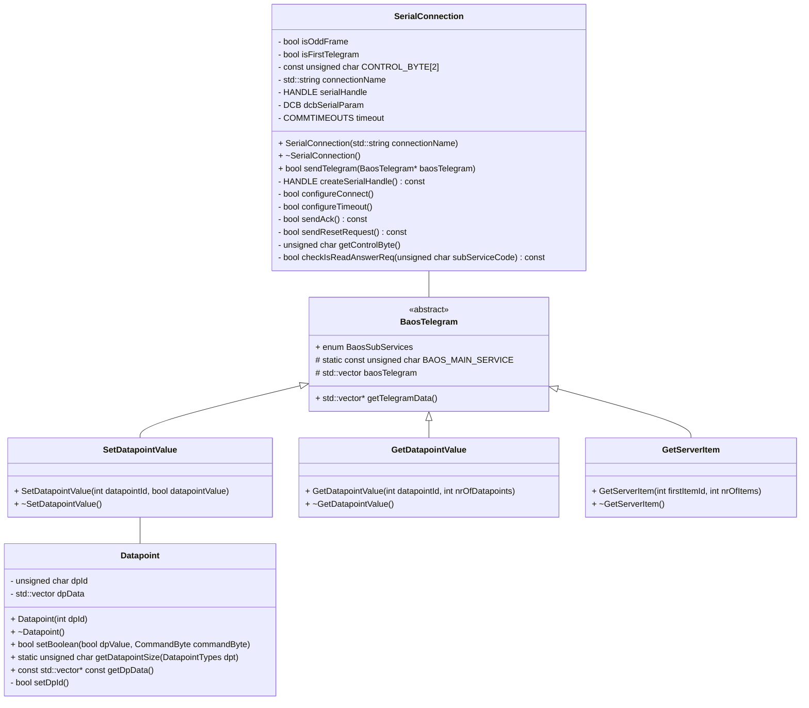

# ClassDiagram

```mermaid

classDiagram

SerialConnection -- BaosTelegram
BaosTelegram <|-- SetDatapointValue
BaosTelegram <|-- GetDatapointValue
BaosTelegram <|-- GetServerItem
SetDatapointValue -- Datapoint

class SerialConnection{
    - bool isOddFrame
	- bool isFirstTelegram
	- const unsigned char CONTROL_BYTE[2]
	- std::string connectionName
	- HANDLE serialHandle
	- DCB dcbSerialParam
	- COMMTIMEOUTS timeout
	
	+ SerialConnection(std::string connectionName)
	+ ~SerialConnection()
    + bool sendTelegram(BaosTelegram* baosTelegram)
    - HANDLE createSerialHandle() const
	- bool configureConnect()
	- bool configureTimeout()
	- bool sendAck() const
	- bool sendResetRequest() const
	- unsigned char getControlByte()
	- bool checkIsReadAnswerReq(unsigned char subServiceCode) const
}

class BaosTelegram{
    <<abstract>>
    + enum BaosSubServices
    # static const unsigned char BAOS_MAIN_SERVICE
    # std::vector<unsigned char> baosTelegram
    
    + std::vector<unsigned char>* getTelegramData()
}

class SetDatapointValue{
	+ SetDatapointValue(int datapointId, bool datapointValue)
	+ ~SetDatapointValue()
}

class GetDatapointValue{
	+ GetDatapointValue(int datapointId, int nrOfDatapoints)
	+ ~GetDatapointValue()
}

class GetServerItem{
	+ GetServerItem(int firstItemId, int nrOfItems)
	+ ~GetServerItem()
}

class Datapoint{
    - unsigned char dpId
    - std::vector<unsigned char> dpData
    
    + Datapoint(int dpId)
    + ~Datapoint()
    + bool setBoolean(bool dpValue, CommandByte commandByte)
    + static unsigned char getDatapointSize(DatapointTypes dpt)
    + const std::vector<unsigned char>* const getDpData()
    - bool setDpId()
}

```