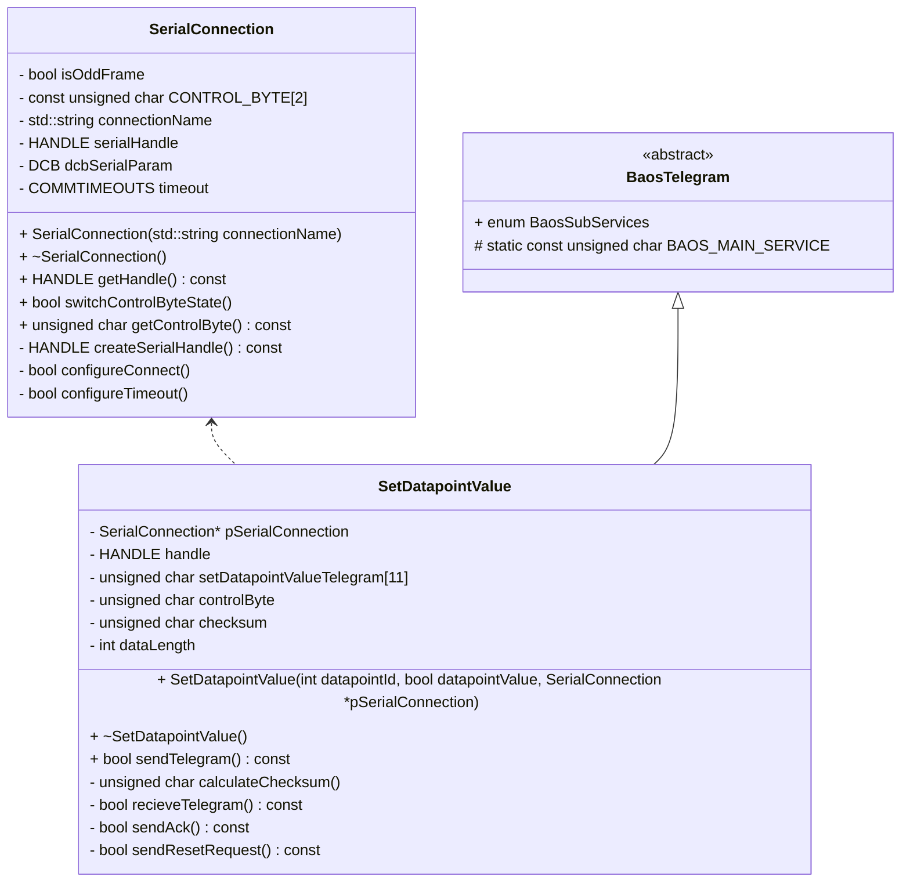

# ClassDiagram

```mermaid

classDiagram

SerialConnection <.. SetDatapointValue
BaosTelegram <|-- SetDatapointValue

class SerialConnection{
    - bool isOddFrame
    - const unsigned char CONTROL_BYTE[2]
    - std::string connectionName
	- HANDLE serialHandle
	- DCB dcbSerialParam
	- COMMTIMEOUTS timeout
	
	+ SerialConnection(std::string connectionName)
	+ ~SerialConnection()
	+ HANDLE getHandle() const
	+ bool switchControlByteState()
	+ unsigned char getControlByte() const
	- HANDLE createSerialHandle() const
	- bool configureConnect()
	- bool configureTimeout()
}

class BaosTelegram{
    <<abstract>>
    + enum BaosSubServices
    # static const unsigned char BAOS_MAIN_SERVICE
}

class SetDatapointValue{
    - SerialConnection* pSerialConnection
    - HANDLE handle
    - unsigned char setDatapointValueTelegram[11]
    - unsigned char controlByte
    - unsigned char checksum
    - int dataLength

	+ SetDatapointValue(int datapointId, bool datapointValue, SerialConnection *pSerialConnection)
	+ ~SetDatapointValue()
	+ bool sendTelegram() const
	- unsigned char calculateChecksum()
    - bool recieveTelegram() const
    - bool sendAck() const
    - bool sendResetRequest() const
}

```